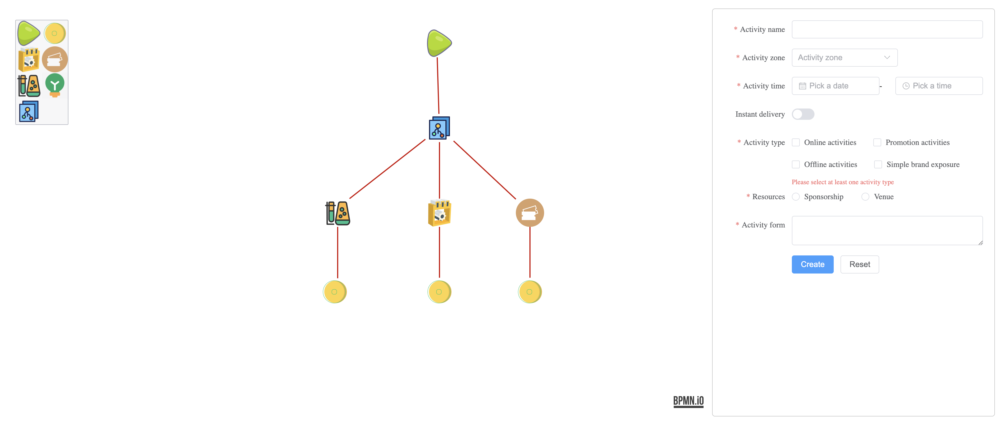

# vue3-bpmn-demo
---

一个对 [bpmnjs](https://bpmn.io/) 封装的 vue3 版本流程图demo；支持针对不同节点，自定义组件以支持更加灵活的自定义逻辑扩展；

### 支持
- 封装组件支持

|  方法名  | 说明 | 参数 | 必需 |
|  ----  | ---- | ---- | ---- |
| selectChange | 选中节点变更 | (newSelection, oldSelection) | no |
| remove:shape | 删除画布上图形 | removeEle | no |

- 自定义bpmn支持
  - 自定义图标
  - 替换原始图标

### demo

### how to start
- `git clone https://github.com/yeyujingren/flowChartDemo.git`
- `npm -i` || `yarn install`
- `npm run dev` || `yarn dev`
